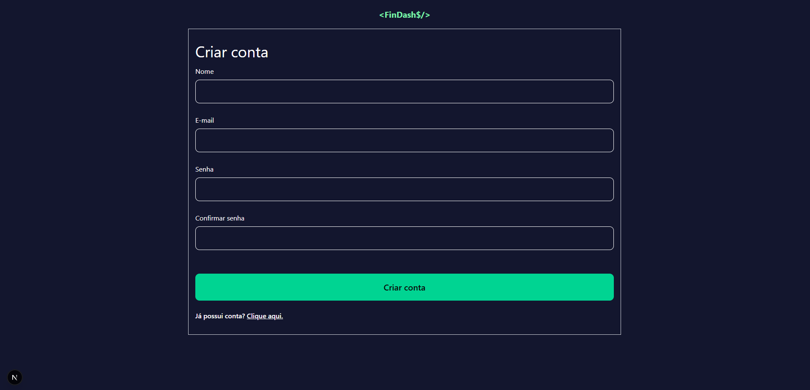
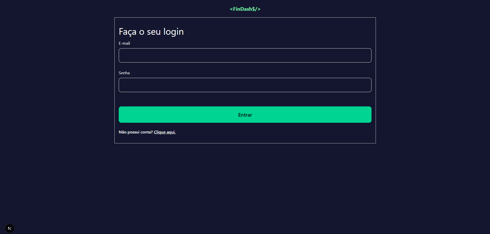
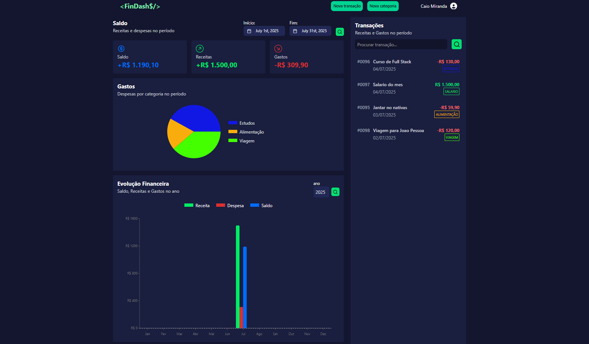

# FinDash$ Dashboard - Sistema de gestor financeiro (Front End)

Este projeto consiste em um organizador financeiro pessoal, fácil, prático e seguro de se utilizar, com autenticação JWT e demonstração de dados através de gráficos.

## ℹ️ Sobre o Projeto

Sistema de gestor financeiro, focado em praticidade e visual leve e agradável. Permite gerenciar transações, categorias e visualizar gráficos com resumos mensais e anuais, além de apresentar um sistema de login.

## 🛠️ Tecnologias Utilizadas

### Front-End: 
- React, Next.js, TypeScript, Tailwind CSS, ShadCN UI, Axios, Context API.

### Back-End: 
- Node.js, Express, PostgreSQL, Prisma, Docker, JWT, Yup, CORS, Bcrypt 
  

## Imagens

