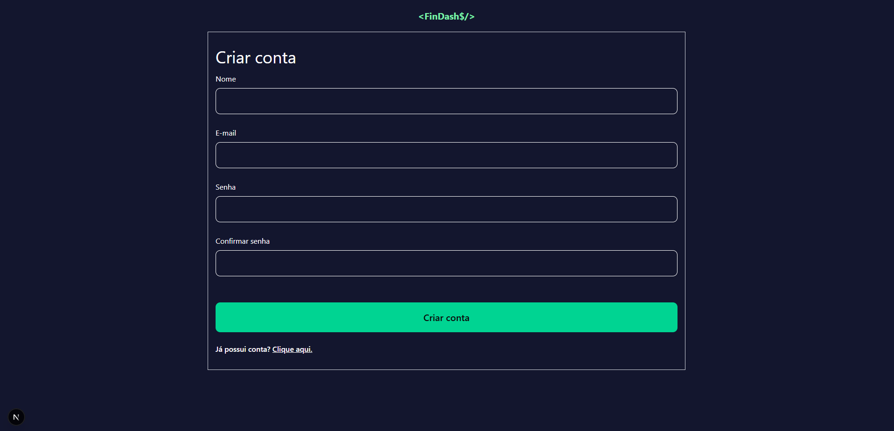
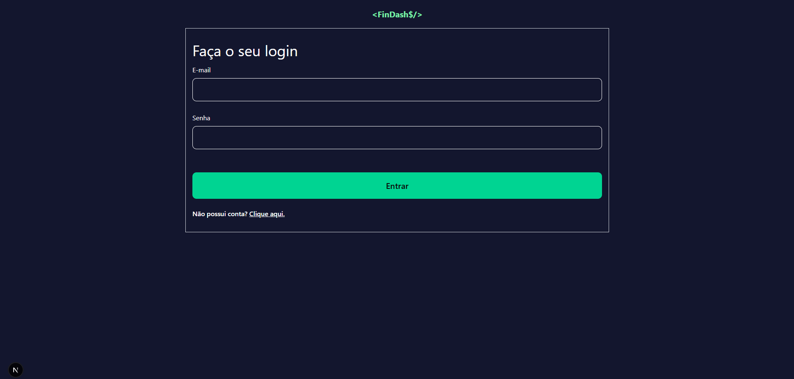
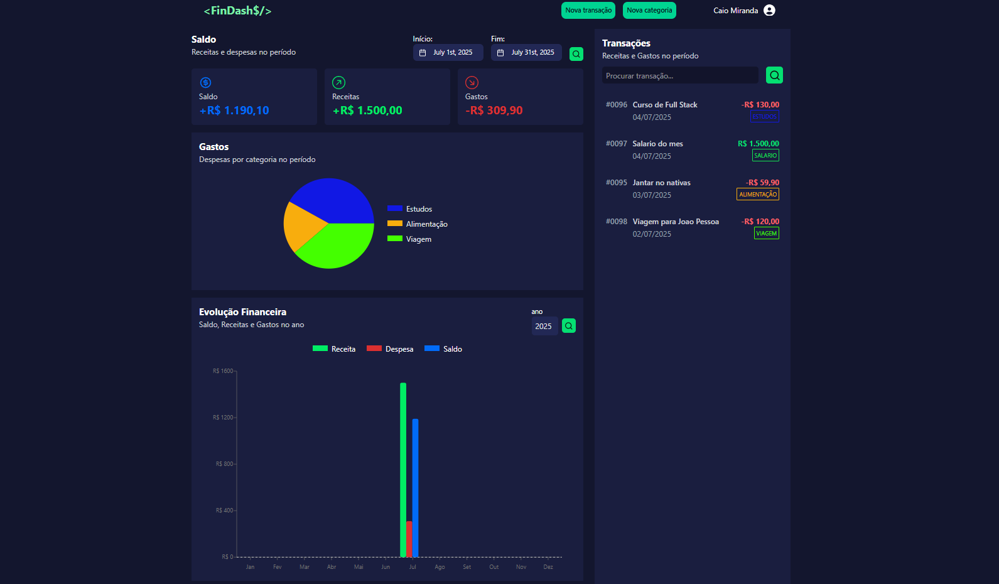
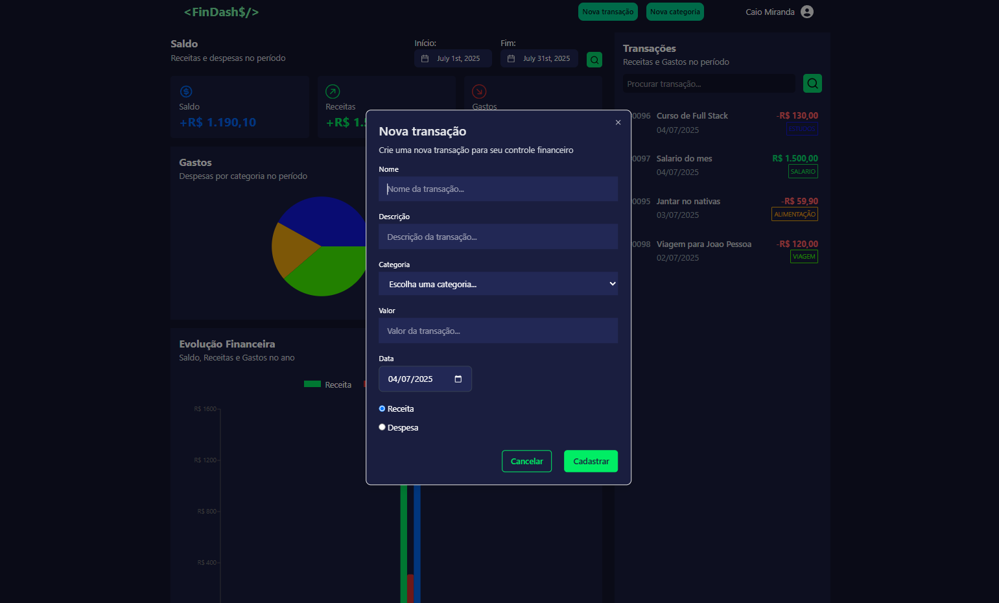
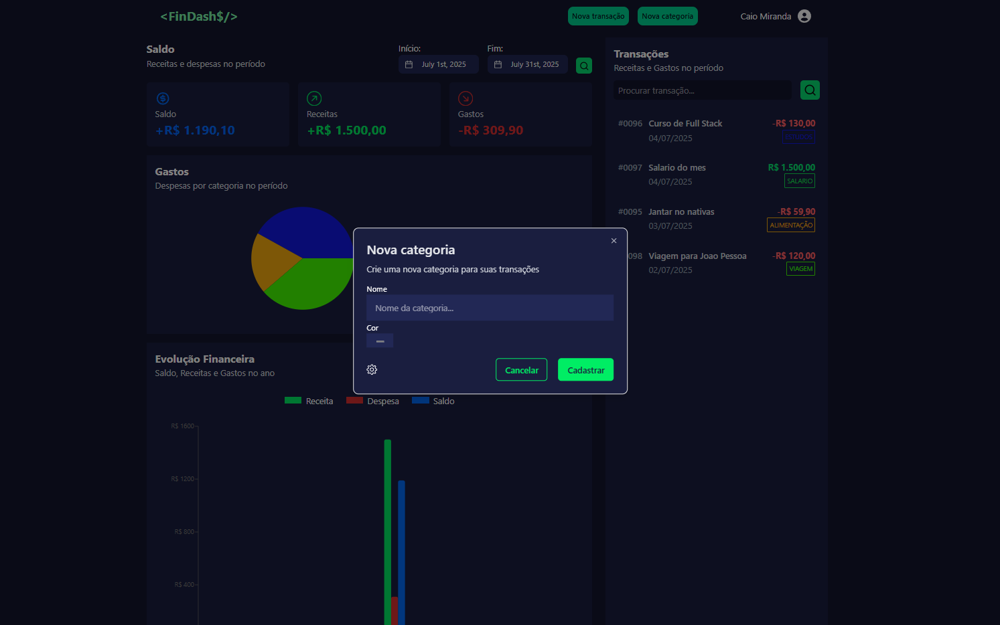

# FinDash$ Dashboard - Sistema de gestor financeiro (Front End)

Este projeto consiste em um organizador financeiro pessoal, fácil, prático e seguro de se utilizar, com autenticação JWT e demonstração de dados através de gráficos.

## ℹ️ Sobre o Projeto

Sistema de gestor financeiro, focado em praticidade e visual leve e agradável. Permite gerenciar transações, categorias e visualizar gráficos com resumos mensais e anuais, além de apresentar um sistema de login.

## 🛠️ Tecnologias Utilizadas

### Front-End: 
- React, Next.js, TypeScript, Tailwind CSS, ShadCN UI, Axios, Context API.

### Back-End: 
- Node.js, Express, PostgreSQL, Prisma, Docker, JWT, Yup, CORS, Bcrypt 
<br><br>

## 🚀 Como iniciar o projeto

```bash
# Clone o repositório
git clone https://github.com/CaioMiranda12/dashboard-interface.git

# Acesse a pasta
cd dashboard-interface

# Abra no VSCode (opcional)
code .

# Instale as dependências
npm install --legacy-peer-deps

# Criar .env
colocar NEXT_PUBLIC_API_URL="http://localhost:3001"

# Inicie o projeto front-end
npm run dev
```


## Imagens






